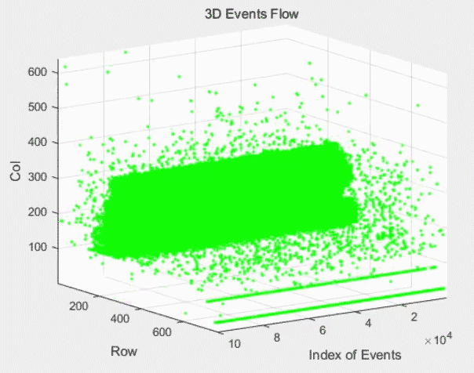

# CelexMatlabToolbox
[中文README](README_中文.md)
## Introduction

CelexMatlabToolbox is a matlab toolbox to process the events collected using Celex IV Dynamic Vision Sensor.

## File structure and Functions

- `createImgFromRawData.m`
  - Real-time decoding of events from raw data.
  - Real-time showing and saving binary pics from raw data.
  - Real-time showing and saving gray pics from raw data.
  - Real-time showing and saving accumulated gray pics from raw data.
- `functions`: a collection of matlab functions.
  - Decode from raw data(`.bin` file) in batches and return events in format of `x,y,adc,t`，where `t`  is the **continuous time stamp**.
  - Save decoded events as mat file in memory-efficient way.
  - Load events from mat file.
  - Show and save binary pics from events.
  - Show and save gray pics from events.
  - Show and save accumulated gray pics from events.
  - Show and save denoised binary pics from events.
  - Show and save denoised gray pics from events.
  - Display 3D events flow from events.
  - Accumulate frames by specified time interval in certain range (in percentage), and user can skip the first specified amount of frames if needed and also determine the time for each frame to show.
- `demo.m`
  - An executable demo file, which **includes all sample usage to call the functions in folder `functions`.**

## Sample Results

- **Denoising**

- **3D Events flow**

- **Accumulated frames with different timeslice**

## Usage

- Before you use
  - Right click on the `CelexMatlabToolbox` folder to **include folder and its subfolders**.
  - Modify the directory and filepath in `demo.m` .
- For each function in `functions` folder,  the description of its corresponding function, input and output is offered. To read the description, please run `help <functionName>` ，for instance`help showAllPic`.
- **You can find sample usage of all functions in `demo.m`**.
  - You will find many code sections that are seperated by `%%` in file `demo.py`, choose the code section you want to run, then click the `Run code section` button in the toolbar to execute the functions of that section.

## TODO

- [x] Visualizing by accumulating events through a specified time interval.
- [ ] Take spatial connection  into consideration to improve denoising results.
- [ ] Take FPN into consideration to improve denoising results.
- [ ] Add `overlap` parameter for visualizing.

## LICENSE

- `Apache-2.0`
